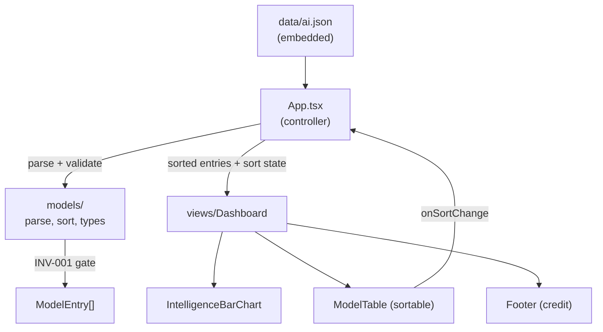
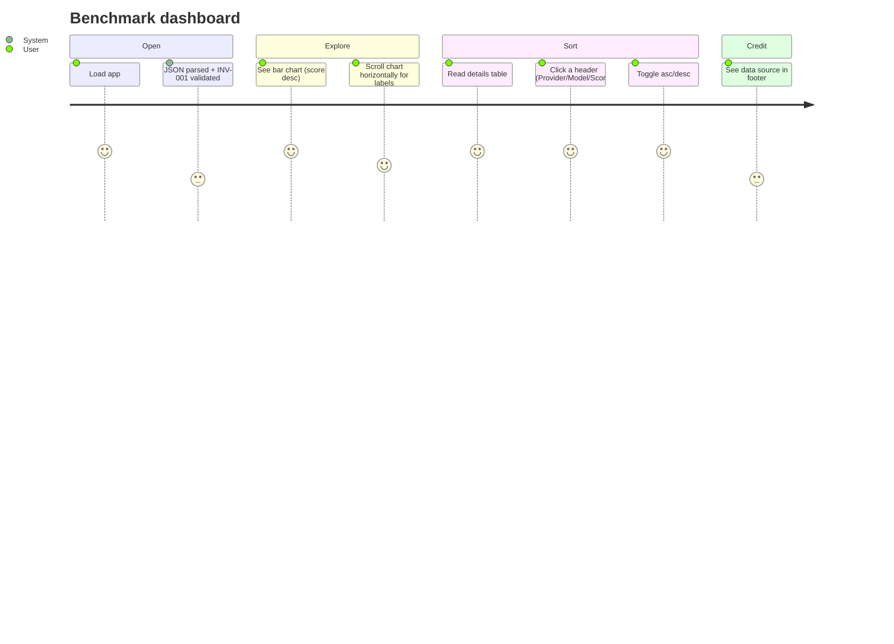

# Architecture

AI model benchmarks dashboard: visualizes and sorts AI model intelligence
scores from an embedded JSON dataset. Derived from the immutable
[`/KERNEL/`](./KERNEL/); if anything here conflicts with the kernel, the kernel
wins.

## Stack

- **Vite + React 18 + TypeScript** (`app/`)
- **MUI** (`@mui/material`) for the UI, light-mode defaults per `KERNEL/DESIGN.md`
- **@mui/x-charts** for the bar chart
- **Vitest + Testing Library** for Red/Green TDD

## Layering (DDD / MVC)

The domain is encapsulated in `app/src/models/`; business logic is kept out of
the views. The `App` component is the controller (owns state and data flow).

### Domain (`models/`)

| File | Responsibility |
| --- | --- |
| `types.ts` | `ModelEntry`, `SortField`, `SortDirection`, `SortState` |
| `parse.ts` | `parseModelEntries` + `InvariantError`; upholds **INV-001** (every model has a provider) and structural guards at the single gate |
| `sort.ts` | `sortModels`, `nextSortState`, `DEFAULT_SORT` (score desc) |
| `index.ts` | Public re-exports |

### Presentation (`views/`)

All views are pure (props in, callbacks out, no business logic):

- `IntelligenceBarChart` - vertical bars sorted by the controller (highest on
  the left by default), horizontally scrollable so labels stay readable.
- `ModelTable` - sortable table; headers `Provider`, `Model Name`, `Score`;
  click toggles asc/desc.
- `Footer` - credits the data source, [artificialanalysis.ai](https://artificialanalysis.ai/).
- `Dashboard` - layout composing the above (progressive disclosure: summary
  chart, then details table, then footer).

### Controller (`App.tsx`)

Parses the embedded JSON once (`useMemo`), holds the `SortState`, computes the
sorted entries, and forwards header clicks through `nextSortState`. Mounted at
the router index route (react-router retained).

## Invariants

- **INV-001** - Every model has a provider. Enforced in `parse.ts`; any
  violation throws `InvariantError` with the offending index before the data
  reaches the view layer.

## User Journey

## Validation

- `npm test` - Vitest unit + component tests (domain logic + dashboard happy
  path / sort interaction).
- `npm run build` - `tsc -b` typecheck + Vite production build.

Tests follow Red/Green TDD with concise table-driven cases for the domain
(parse/INV-001, sorting) and a high-value happy path for the dashboard.
