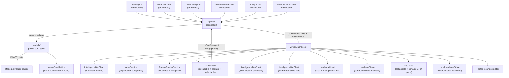
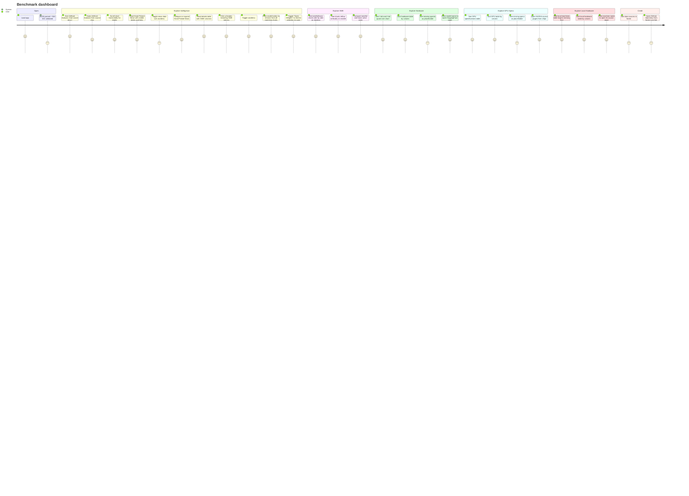

# Architecture

AI model benchmarks dashboard: visualizes, filters, and sorts embedded model
benchmark datasets, a dated news feed, HuggingFace estimated hardware sizes
for 1-bit and 2-bit dynamic quants, NVIDIA GPU specifications, and
unified-memory local-AI machines (Mac, DGX Spark, Strix Halo). It
currently renders Artificial Analysis scores and Senior SWE Bench
tasteful/basic solve rates. Models can be toggled in/out of the charts
individually, or restricted to open-weight models via the "Open Weights"
preset. Derived from the immutable
[`/KERNEL/`](./KERNEL/); if anything here conflicts with the kernel, the kernel
wins.

## Stack

- **Vite + React 18 + TypeScript** (`app/`)
- **MUI** (`@mui/material`) for the UI, light-mode defaults per `KERNEL/DESIGN.md`
- **@mui/x-charts** for the bar chart
- **Vitest + Testing Library** for Red/Green TDD

## Layering (DDD / MVC)

The domain is encapsulated in `app/src/models/`; business logic is kept out of
the views. The `App` component is the controller (owns state and data flow).

### Domain (`models/`)

| File | Responsibility |
| --- | --- |
| `types.ts` | `ModelEntry`, `NewsEntry`, `HardwareEntry`, `GpuEntry`, `MachineEntry`, their raw JSON shapes, and benchmark sort types; `ModelEntry.open_weight` is always present after parse; `ModelEntry.color` is the explicit bar color carried from `ai.json` |
| `parse.ts` | `parseModelEntries`, `parseSweEntries`, `parseNewsEntries`, `parseHardwareEntries`, `parseGpuEntries`, `parseMachineEntries`, provider/open-weight inference, and `InvariantError`; upholds **INV-001** (every model has a provider) and structural guards at the single gate. News URLs and ISO dates are validated, copied, and sorted newest first before reaching the view. Hardware entries are validated (provider, model, total_params, url required; 1-bit and 2-bit quant sizes nullable). GPU entries are validated (model, date required; memory, memory_type, memory_bandwidth_gbs, fp16_tflops nullable). Machine entries are validated (machine, chip, vram_gb, url required; memory_bandwidth_gbs, price_usd nullable). SWE provider rules cover Claude, GPT, Grok, GLM, Kimi, Gemini, MiniMax, and Inkling |
| `merge.ts` | `mergeSweMetrics`, `modelMatchKey`; adds optional SWE table columns to matching Artificial Analysis rows. `modelMatchKey` ignores parenthetical effort suffixes and "preview" |
| `sort.ts` | `sortModels`, `nextSortState`, `DEFAULT_SORT` (score desc) |
| `filter.ts` | `openWeightIds`; the id set used by the "Open Weights" preset |
| `index.ts` | Public re-exports |

`data/swe.json` does not include provider fields, so `parseSweEntries` derives
provider from known model-family prefixes (Claude, GPT, Grok, GLM, Kimi,
Gemini). Unknown families fail as **INV-001** violations instead of being
rendered without a provider. The source site currently lists 17 runs;
`swe.json` additionally retains four models no longer listed (Kimi K2.6,
GPT-5.6 Luna, Inkling, Claude Sonnet 4.6) at their last published values.

`data/ai.json` scores track the Artificial Analysis Intelligence Index
(currently v4.1.1).

### Presentation (`views/`)

All views are pure (props in, callbacks out, no business logic):

- `IntelligenceBarChart` - vertical bars sorted by the controller (highest on
  the left by default), horizontally scrollable so labels stay readable,
  colored by the explicit `color` field each `ai.json` row carries, falling
  back to a provider/model-family lookup for SWE-only entries, with diagonal
  x-axis labels. The lead chart embeds its Artificial Analysis source credit as
  a chip (linking to the AA homepage) in the upper-right of the chart frame and
  uses only a small margin
  below the x-axis allocation so the "Model" title sits close to the frame. The
  lower SWE comparison charts use fit-to-width mode with skinnier bars to avoid
  horizontal chart scrollbars.
- `ModelTable` - collapsible (Accordion, expanded by default) sortable table;
  headers `Provider`, `Model Name`, `Intelligence`, `basic_solve_rate_pct`,
  `tasteful_solve_rate_pct`, `avg_steps`, and `avg_tokens`; click headers to
  toggle asc/desc. The table scrolls horizontally on narrow viewports. Missing
  SWE values render as `*`. Model names are buttons; clicking toggles matching
  model inclusion across all charts while the row remains visible when
  deselected, with a gray background and faded text. An "Open Weights" toggle
  sits immediately to the right of the title in the accordion summary;
  clicking it does not toggle the accordion. Turning it on sets the selection
  to the open-weight models, turning it off re-selects every model.
- `Footer` - credits the non-GPU data sources,
  [Artificial Analysis](https://artificialanalysis.ai/articles/artificial-analysis-intelligence-index-v4-1-1),
  [Senior SWE Bench](https://senior-swe-bench.snorkel.ai/), and
  [HuggingFace](https://huggingface.co/unsloth), and links to the
  [GitHub repository](https://github.com/johnpfeiffer/benchmarks) with an inline
  GitHub SVG mark. GPU-specific source links are rendered uniquely below the
  GPU specifications table rather than duplicated here.
- `NewsSection` - outlined accordion immediately below the lead chart, expanded
  by default and user-collapsible, titled "Hand Picked News" with a small
  fresh-tomato SVG mark. Each row shows the ISO publication date in an
  unobtrusive light-gray left column alongside the URL link (which also carries
  the date as a hover title). A subtle `TableSortLabel` on the date header
  toggles between descending (default, newest first) and ascending; the sort is
  local `useState`/`useMemo` in the component and does not affect controller
  state.
- `ParetoFrontierSection` - outlined accordion between the news and the model
  details table, expanded by default and user-collapsible, titled "Pareto
  frontier". Renders a static captured snapshot of Artificial Analysis'
  "Intelligence Index vs. Cost to Run" scatter chart (dotted Pareto line,
  provider-colored dots) from `src/assets/artificial-analysis-pareto-frontier.png`
  (a bundled, fingerprinted import so it is served from the same `/assets/`
  path root as the JS bundle — a root-absolute `public/` URL can be swallowed
  by SPA-fallback routing on multi-app hosts),
  scaled responsively with descriptive alt text, plus a caption crediting and
  linking to Artificial Analysis with the capture date.
- `HardwareChart` - grouped bar chart comparing 1-bit and 2-bit dynamic
  quant (UD-IQ1_S, UD-IQ1_M, UD-IQ2_XXS, UD-IQ2_M) estimated hardware sizes
  across models, sourced from Unsloth GGUF releases on HuggingFace. Entries
  are sorted by total params descending (largest first, left to right).
  Models without a given quant appear on the x-axis but their bars are
  omitted. Includes a source chip linking to HuggingFace.
- `HardwareTable` - sortable table of hardware details; headers `Model`,
  `Provider`, `Intelligence`, `Total Params`, `UD-IQ1_S (GB)`, `UD-IQ1_M (GB)`,
  `UD-IQ2_XXS (GB)`, `UD-IQ2_M (GB)`; click headers to toggle asc/desc. Model
  names link to their HuggingFace model pages. Missing quants render as `*`.
  The `Intelligence` column is attached by the controller
  (`mergeHardwareIntelligence`) via the same normalized model-name match as
  the SWE merge, with a unique-prefix fallback for size-suffixed rows (e.g.
  "Nemotron 3 Ultra 550B"); models without an `ai.json` row render `*`.
  Default sort is total params descending (largest first). Sort is local
  `useState`/`useMemo` in the component. Total params are parsed to billions
  for numeric sorting (e.g. "2.8T" -> 2800).
- `GpuTable` - collapsible (Accordion, expanded by default) sortable table of
  GPU specifications; headers `GPU Model`, `Date`, `Memory`, `Memory Type`,
  `Mem BW (GB/s)`, `Dense FP16`; click headers to toggle asc/desc. Missing
  values render as `*`. Default sort is date descending (newest first). Sort
  is local `useState`/`useMemo` in the component. GPU source links are
  rendered as plain links below the table.
- `LocalHardwareTable` - sortable table of unified-memory machines for local
  inference; headers `Machine`, `Chip`, `Unified Memory (GB)`,
  `Mem BW (GB/s)`, `Price (USD)`; click headers to toggle asc/desc. Machine
  names link to their source pages. Missing values render as `*`. Prices
  render as `$9,499`-style USD. Default sort is unified memory descending
  (largest first). Sort is local `useState`/`useMemo` in the component.
  Machine source links (Daring Fireball, NVIDIA, Framework) are rendered as
  plain links below the table.
- `Dashboard` - layout composing the intelligence chart, collapsible enriched
  details table, responsive side-by-side SWE comparison charts (Basic Solve
  Rate on the left, Tasteful on the right, each with a Senior SWE Bench source
  chip), an "Open Weights" toggle beside the SWE title, HuggingFace estimated
  hardware chart and table ("Open Weight Hosting Sizes"), collapsible GPU
  specifications table with source links below, then a Local Hardware section
  ("Local AI Machines") with source links below, then footer. News sits
  between the lead intelligence chart and model details.

### Controller (`App.tsx`)

Parses embedded JSON once (`useMemo`), including validated newest-first news,
HuggingFace hardware entries, GPU specification entries, and local machine
entries, merges SWE metrics into the main
Artificial Analysis table rows, holds the table `SortState` and selected model
IDs for the intelligence chart, computes sorted/chart-visible entries, and
forwards header clicks through `nextSortState`. Deselected table model names are
converted to match keys and filtered out of the Artificial Analysis chart plus
both SWE charts when corresponding SWE rows exist. The main table now includes
the three SWE-only models (Claude Opus 4.7, GPT-5.4 (xhigh), Claude Sonnet 4.6)
as not-open-weight rows, so every SWE model has an Artificial Analysis
counterpart and the "Open Weights" preset propagates fully to the SWE
charts. The SWE data covers 21 models from senior-swe-bench.snorkel.ai. The
preset is a selection: on ->
`replaceSelection(openWeightIds(...))`; off -> `replaceSelection(allIds)`, so the
table graying/fading and every chart follow the selection. The SWE charts are
rendered below the table from `swe.json` rows sorted by score descending:
Basic Solve Rate on the left, Tasteful Solve Rate on the right, each with a
source chip linking to Senior SWE Bench. An "Open Weights" toggle beside the
SWE title mirrors the one in the Model Details table. Mounted at the router
index route (react-router retained).

## Invariants

- **INV-001** - Every model has a provider. Enforced in `parse.ts`; any
  violation throws `InvariantError` with the offending index before the data
  reaches the view layer.

## User Journey

## Validation

- `npm test` - Vitest unit + component tests (domain logic + dashboard happy
  path / sort interaction / all-chart model filtering / SWE metric merge /
  source credits / news validation, ordering, visible dates, sort toggle, and
  collapse behavior / hardware entry validation and dashboard rendering / GPU
  entry validation and dashboard rendering / machine entry validation and
  dashboard rendering).
- `npm run build` - `tsc -b` typecheck + Vite production build.

Tests follow Red/Green TDD with concise table-driven cases for the domain
(parse/INV-001, sorting, SWE metric merge) and high-value dashboard paths for
rendering, sorting, filtering, placeholders, and credits.
