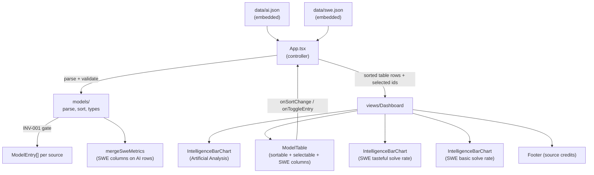
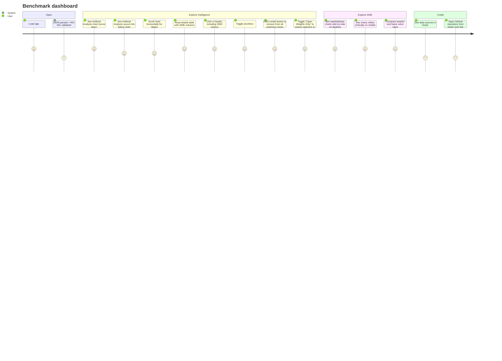

# Architecture

AI model benchmarks dashboard: visualizes, filters, and sorts embedded model
benchmark datasets. It currently renders Artificial Analysis scores and Senior
SWE Bench tasteful/basic solve rates. Models can be toggled in/out of the charts
individually, or restricted to open-weight models via the "Open Weights Only"
preset. Derived from the immutable [`/KERNEL/`](./KERNEL/); if anything here
conflicts with the kernel, the kernel wins.

## Stack

- **Vite + React 18 + TypeScript** (`app/`)
- **MUI** (`@mui/material`) for the UI, light-mode defaults per `KERNEL/DESIGN.md`
- **@mui/x-charts** for the bar chart
- **Vitest + Testing Library** for Red/Green TDD

## Layering (DDD / MVC)

The domain is encapsulated in `app/src/models/`; business logic is kept out of
the views. The `App` component is the controller (owns state and data flow).

### Domain (`models/`)

| File | Responsibility |
| --- | --- |
| `types.ts` | `ModelEntry`, `SortField`, `SortDirection`, `SortState`; `ModelEntry.open_weight` is always present after parse |
| `parse.ts` | `parseModelEntries`, `parseSweEntries`, `inferProviderFromModel`, `isOpenWeightModel` + `InvariantError`; upholds **INV-001** (every model has a provider) and structural guards at the single gate. Reads `open_weight` from `ai.json` and infers it from the model family for `swe.json` |
| `merge.ts` | `mergeSweMetrics`, `modelMatchKey`; adds optional SWE table columns to matching Artificial Analysis rows |
| `sort.ts` | `sortModels`, `nextSortState`, `DEFAULT_SORT` (score desc) |
| `filter.ts` | `openWeightIds`; the id set used by the "Open Weights Only" preset |
| `index.ts` | Public re-exports |

`data/swe.json` does not include provider fields, so `parseSweEntries` derives
provider from known model-family prefixes (Claude, GPT, Grok, GLM, Kimi,
Gemini). Unknown families fail as **INV-001** violations instead of being
rendered without a provider.

### Presentation (`views/`)

All views are pure (props in, callbacks out, no business logic):

- `IntelligenceBarChart` - vertical bars sorted by the controller (highest on
  the left by default), horizontally scrollable so labels stay readable,
  provider/model-family colored, with diagonal x-axis labels. The lower SWE
  comparison charts use fit-to-width mode with skinnier bars to avoid horizontal
  chart scrollbars.
- `ModelTable` - sortable table; headers `Provider`, `Model Name`, `Intelligence`;
  `tasteful_solve_rate_pct`, `basic_solve_rate_pct`, `avg_steps`, and
  `avg_tokens`; click headers to toggle asc/desc. The table expands to full
  height and scrolls horizontally on narrow viewports. Missing SWE values render
  as `*`. Model names are buttons; clicking toggles matching model inclusion
  across all charts while the row remains visible when deselected, with a gray
  background and faded text. An "Open Weights Only" toggle sits beside the
  title; turning it on sets the selection to the open-weight models, turning it
  off re-selects every model.
- `Footer` - credits both data sources,
  [Artificial Analysis](https://artificialanalysis.ai/) and
  [Senior SWE Bench](https://senior-swe-bench.snorkel.ai/), and links to the
  [GitHub repository](https://github.com/johnpfeiffer/benchmarks) with an inline
  GitHub SVG mark.
- `Dashboard` - layout composing the intelligence chart, enriched details
  table, responsive side-by-side SWE comparison charts, then footer. The
  Artificial Analysis chart also has a direct source link immediately below it.

### Controller (`App.tsx`)

Parses embedded JSON once (`useMemo`), merges SWE metrics into the main
Artificial Analysis table rows, holds the table `SortState` and selected model
IDs for the intelligence chart, computes sorted/chart-visible entries, and
forwards header clicks through `nextSortState`. Deselected table model names are
converted to match keys and filtered out of the Artificial Analysis chart plus
both SWE charts when corresponding SWE rows exist. The main table now includes
the three SWE-only models (Claude Opus 4.7, GPT-5.4 (xhigh), Claude Sonnet 4.6)
as not-open-weight rows, so every SWE model has an Artificial Analysis
counterpart and the "Open Weights Only" preset propagates fully to the SWE
charts. The preset is a selection: on ->
`replaceSelection(openWeightIds(...))`; off -> `replaceSelection(allIds)`, so the
table graying/fading and every chart follow the selection. The SWE charts are
rendered below the table from `swe.json` rows sorted by score descending: one
chart for `tasteful_solve_rate_pct`, one for `basic_solve_rate_pct`. Mounted at
the router index route (react-router retained).

## Invariants

- **INV-001** - Every model has a provider. Enforced in `parse.ts`; any
  violation throws `InvariantError` with the offending index before the data
  reaches the view layer.

## User Journey

## Validation

- `npm test` - Vitest unit + component tests (domain logic + dashboard happy
  path / sort interaction / all-chart model filtering / SWE metric merge /
  source credits).
- `npm run build` - `tsc -b` typecheck + Vite production build.

Tests follow Red/Green TDD with concise table-driven cases for the domain
(parse/INV-001, sorting, SWE metric merge) and high-value dashboard paths for
rendering, sorting, filtering, placeholders, and credits.
