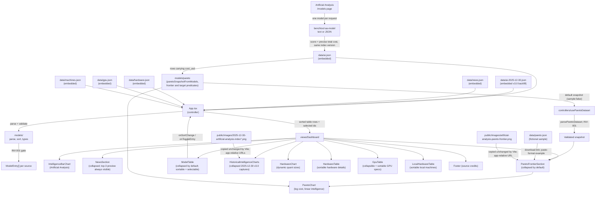
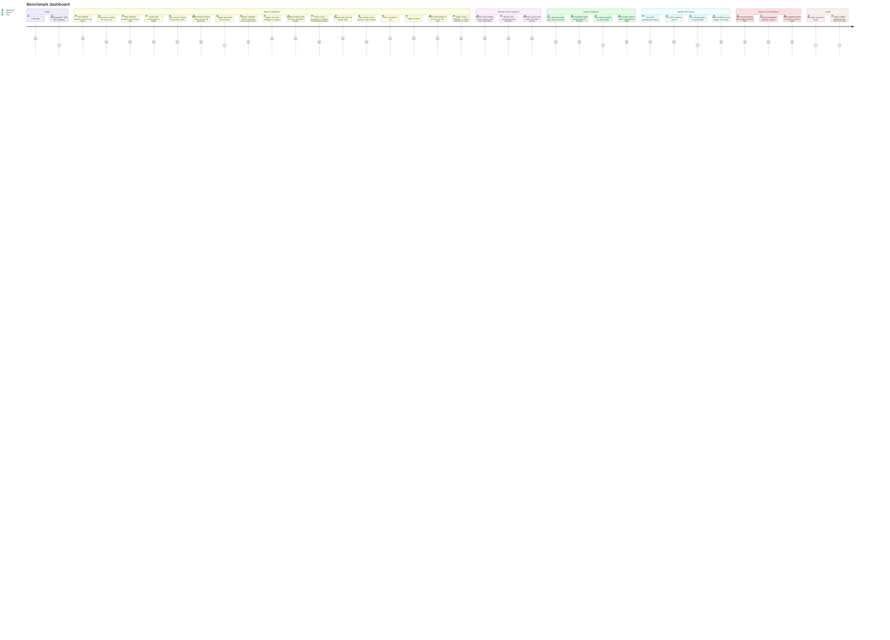

# Architecture

AI model benchmarks dashboard: visualizes, filters, and sorts embedded model
benchmark datasets, a dated news feed, HuggingFace estimated hardware sizes
for dynamic quants (UD-IQ1_M, UD-Q2_K_XL, UD-Q4_K_XL), NVIDIA GPU specifications, and
unified-memory local-AI machines (Mac, DGX Spark, Strix Halo). It
currently renders Artificial Analysis scores. Models can be toggled
in/out of the chart
individually, or restricted to open-weight models via the "Open Weights"
preset. Derived from the immutable
[`/KERNEL/`](./KERNEL/); if anything here conflicts with the kernel, the kernel
wins.

## Stack

- **Vite + React 18 + TypeScript** (`app/`)
- **MUI** (`@mui/material`) for the UI, light-mode defaults per `KERNEL/DESIGN.md`
- **@mui/x-charts** for the bar chart
- **Vitest + Testing Library** for Red/Green TDD
- **Go** (`tools/benchtool/`) for the benchmark-lookup CLI used by the
  `.agents/skills/` workflows: fetches source pages and prints just the
  fields the agent needs (AA model score/provider/open-weights/release,
  index version, precise total evaluation cost and its provenance/precision,
  every leaderboard variant's release date via `aa-releases`, news-page
  date signals) so whole pages stay out of
  context, and inserts rows into the data JSON with the repo's formatting,
  ordering, and dedupe conventions (`news-add`, `ai-add`, `ai-set-released`)

## Layering (DDD / MVC)

The domain is encapsulated in `app/src/models/`; business logic is kept out of
the views. The `App` component is the controller (owns state and data flow).

### Domain (`models/`)

| File | Responsibility |
| --- | --- |
| `types.ts` | `ModelEntry`, `NewsEntry`, `HardwareEntry`, `GpuEntry`, `MachineEntry`, their raw JSON shapes, and benchmark sort types; `ModelEntry.open_weight` is always present after parse; `ModelEntry.color` is the explicit bar color carried from `ai.json`; `ModelEntry.released` is the release date (`YYYY-MM-DD` or null); `ModelEntry.aa_version` is the required Intelligence Index version tag carried from `ai.json` (`ModelEntry.id` stays versionless so selections survive version switches); `ModelEntry.cost_usd` is the optional total benchmark run cost carried from `ai.json` |
| `parse.ts` | `parseModelEntries`, `parseNewsEntries`, `parseHardwareEntries`, `parseGpuEntries`, `parseMachineEntries`, and `InvariantError`; upholds **INV-001** (every model has a provider) and structural guards at the single gate. News URLs and ISO dates are validated, copied, and sorted newest first before reaching the view; model release dates share the same strict calendar-date guard (`MODEL-RELEASED`), and index version tags are shape-checked (`MODEL-AA-VERSION`). Hardware entries are validated (provider, model, total_params, url required; quant sizes nullable). GPU entries are validated (model, date required; memory, memory_type, memory_bandwidth_gbs, fp16_tflops nullable). Machine entries are validated (machine, chip, vram_gb, url required; memory_bandwidth_gbs, price_usd nullable) |
| `merge.ts` | `mergeHardwareIntelligence`, `modelMatchKey`; attaches each hardware row's intelligence score via a normalized model-name match with a unique-prefix fallback. `modelMatchKey` ignores parenthetical effort suffixes and "preview". Callers pass the newest version's block only (see `App.tsx`), since a hardware row carries a single score |
| `version.ts` | `compareAAVersions`, `aaVersionsDesc`, `filterByAAVersion`; numeric newest-first ordering of the `aa_version` tags present in a row set, and the per-version row slice the dashboard renders |
| `sort.ts` | `sortModels`, `nextSortState`, `DEFAULT_SORT` (score desc) |
| `filter.ts` | `openWeightIds`; the id set used by the "Open Weights" preset |
| `index.ts` | Public re-exports |

`data/ai.json` tracks the Artificial Analysis Intelligence Index, keeping one
row per model **per index version**: every row carries `aa_version` (e.g.
`v4.3`, the tags from AA's methodology version history, enforced by
`MODEL-AA-VERSION` in `parse.ts`). A methodology refresh augments the file —
the re-measured rows are inserted as a new block and the previous block is
kept — so older snapshots survive and score variance stays visible in the
data itself. Rows are grouped newest version block first, score descending
within a block (ties keep file order; `benchtool ai-add` maintains both). A
model never re-measured under a version simply has no row in that block. The
chart and Model Details table show one version at a time, switched by the
toggle in the chart section header or the identical one in the Model Details
summary; hardware rows always merge their score
from the newest block. Entry ids are versionless (`provider:model`), and a
version switch resets the selection to exactly the shown version's models
(carrying a selection across snapshots with different model sets produced
charts showing only a stray shared model). The v3.0
snapshot is a 2025-12-30 backfill kept in `data/ai-2025-12-30.json` and
concatenated with `ai.json` at parse time, so `ai.json` stays the curated
current ledger while the toggle lists v4.3, v4.2, and v3.0. Every row carries a
verified `released` date sourced from the Artificial Analysis leaderboard
(`benchtool aa-releases`). A row may also carry `cost_usd`: the precise total
Artificial Analysis charges to run the index on that model, read from the
same model page under the same index version as the score
(`benchtool aa-model <slug> --json`). The key is omitted when AA publishes no
precise total (a $0 total is also omitted — the Pareto log cost axis cannot
plot it), and `parse.ts` rejects non-positive or non-numeric values
(`MODEL-COST`). The `cost_usd` column powers the Pareto default snapshot
(see `ParetoFrontierSection` below).

### Presentation (`views/`)

All views are pure (props in, callbacks out, no business logic):

- `IntelligenceBarChart` - vertical bars sorted by the controller (highest on
  the left by default), horizontally scrollable so labels stay readable,
  colored by the explicit `color` field each `ai.json` row carries, falling
  back to a provider/model-family lookup when a row carries no color, with
  diagonal
  x-axis labels. The chart shows each bar's score above the bar in small
  secondary-colored text (MUI X `barLabel: 'value'` with
  `barLabelPlacement: 'outside'`, gated by the `barValues` prop) and starts
  the y-axis near the lowest score to cut empty space (`yMin`). The section
  heading carries a plain "Source" link beside it (to the AA homepage).
  MUI X sets `touch-action: pan-y` on its chart layer container (zoom
  support), which would block horizontal touch scrolling of the chart's
  overflow container; the scroller overrides it via the container's stable
  `MuiChartsSurface-root` utility class (the emotion-labeled class exists
  only in non-production builds, so keying on it breaks mobile scrolling in
  the deployed bundle).
- `ModelTable` - collapsible (Accordion, collapsed by default) sortable table;
  headers `Intelligence`, `Model Name`, `Provider`, `Released`, and
  `Benchmark cost USD`; click headers to
  toggle asc/desc (default: intelligence descending). When the data carries
  more than one index version, the accordion summary carries the same
  index-version `ToggleButtonGroup` as the chart header (same selected-state
  styling, clicks do not toggle the accordion). The release date renders
  in italics after the provider,
  `*` when unknown; ISO dates sort chronologically and unknown
  dates sort last in both directions. The cost column shows the total
  benchmark run cost as USD (`*` when AA publishes no precise total, sorting
  last in both directions) with an italic footnote ("USD Cost to Run
  Artificial Analysis Intelligence Index") below the table. The table scrolls
  horizontally on narrow
  viewports. Model names are buttons; clicking toggles the
  model's inclusion in the chart while the row remains visible when
  deselected, with a gray background and faded text. An "Open Weights" toggle
  sits immediately to the right of the title in the accordion summary;
  clicking it does not toggle the accordion. Turning it on sets the selection
  to the open-weight models, turning it off re-selects every model.
- `Footer` - credits the non-GPU data sources,
  [Artificial Analysis Intelligence Index v4.3](https://artificialanalysis.ai/articles/artificial-analysis-intelligence-index-v4-3)
  (the label names the newest index version present in `ai.json`; bump both
  the label and the article URL when a new version block lands) and
  [HuggingFace](https://huggingface.co/unsloth), and links to the
  [GitHub repository](https://github.com/johnpfeiffer/benchmarks) with an inline
  GitHub SVG mark. GPU-specific source links are rendered uniquely below the
  GPU specifications table rather than duplicated here.
- `NewsSection` - outlined collapsible panel immediately below the lead chart,
  collapsed by default and user-expandable, titled "Hand Picked News" with a
  small fresh-tomato SVG mark. The top 3 links of the current sort stay
  visible below the header; clicking the header expands the panel to reveal
  the remaining entries. (MUI Accordion moves every child after the summary
  into the collapsed region, so the disclosure is built from ButtonBase +
  Collapse to keep the preview outside it.) Each row shows the ISO
  publication date in an
  unobtrusive light-gray left column alongside the URL link (which also carries
  the date as a hover title). A subtle `TableSortLabel` on the date header
  toggles between descending (default, newest first) and ascending; the sort is
  local `useState`/`useMemo` in the component and does not affect controller
  state.
- `ParetoFrontierSection` - outlined accordion between the news and the model
  details table, collapsed by default and user-expandable, titled "Pareto
  frontier". The published snapshot is derived at load from the `ai.json` rows
  carrying `cost_usd` (`paretoSnapshotFromModels` in `models/pareto.ts`,
  surfaced through `controllers/useParetoDataset`), so the default chart is
  real measured data (`sample: false`) and stays single-version:
  `PARETO_SNAPSHOT_AA_VERSION` pins which `aa_version` block the points are
  drawn from, and each point pairs the score and cost read from the same AA
  model page under that index version. The snapshot's version/date constants
  (`PARETO_SNAPSHOT_AA_VERSION`, `PARETO_SNAPSHOT_VERSION`,
  `PARETO_SNAPSHOT_DATE`) are bumped with each
  `ai.json` re-snapshot. `models/pareto.ts` validates provider
  (INV-001), unique model variants, positive finite cost, intelligence 0–100,
  snapshot date, benchmark version, and explicit sample status.
  `ParetoChart` renders an SVG scatter plot with logarithmic USD cost, linear
  intelligence, provider colors, optional labels, and hover/focus/tap details.
  The target inputs start at a $1,000 cost ceiling and an intelligence floor
  of 42. The green area uses strict `cost < X && intelligence > Y` thresholds. The
  dotted frontier uses all points, independent of thresholds: another point
  must have no higher cost and no lower intelligence, with at least one strict
  improvement, to dominate a point. Identical tradeoffs remain on the frontier.
  Pasted JSON is validated before replacing the current preview; invalid data
  leaves the previous chart intact. Imports last until refresh. Reload restores
  the ai.json-derived published snapshot. The bundled `data/pareto.json` keeps
  its fictional sample rows purely as the paste-format example behind the
  download link. See [data format](docs/pareto-data.md).
  A collapsed reference panel retains the static captured snapshot of Artificial Analysis'
  "Intelligence Index vs. Cost to Run" scatter chart (dotted Pareto line,
  provider-colored dots) from `public/images/artificial-analysis-pareto-frontier.png`.
  Vite copies it unchanged to `dist/images/`. The view uses the relative URL
  `images/artificial-analysis-pareto-frontier.png`, matching AIEWF's public
  image pattern. The deployed host injects `<base href="/benchmarks/">`, so
  the browser requests `/benchmarks/images/artificial-analysis-pareto-frontier.png`;
  local root development resolves it under `/images/`. Do not import the PNG
  or add a leading slash: the previous bundled `/assets/...` URL bypassed the
  app base and returned HTTP 404. The image is
  scaled responsively with descriptive alt text, plus a caption crediting and
  linking to Artificial Analysis with the capture date.
- `HardwareChart` - grouped bar chart comparing dynamic
  quant (UD-IQ1_M, UD-Q2_K_XL, UD-Q4_K_XL) estimated hardware sizes
  across models, sourced from Unsloth GGUF releases on HuggingFace. Entries
  are sorted by total params descending (largest first, left to right).
  Models without a given quant appear on the x-axis but their bars are
  omitted. Includes a source chip linking to HuggingFace.
- `HardwareTable` - sortable table of hardware details titled "Unsloth Open
  Weight Hosting Sizes"; headers `Model`,
  `Provider`, `Intelligence`, `Total Params`, `UD-IQ1_M (GB)`,
  `UD-Q2_K_XL (GB)`, `UD-Q4_K_XL (GB)`; click headers to toggle asc/desc. Model
  names link to their HuggingFace model pages. Missing quants render as `*`.
  The `Intelligence` column is attached by the controller
  (`mergeHardwareIntelligence`) via the normalized `modelMatchKey`
  model-name match, with a unique-prefix fallback for size-suffixed rows (e.g.
  "Nemotron 3 Ultra 550B"); models without an `ai.json` row render `*`.
  Default sort is intelligence descending (highest first; unscored rows last
  in both directions). Sort is local
  `useState`/`useMemo` in the component. Total params are parsed to billions
  for numeric sorting (e.g. "2.8T" -> 2800).
- `GpuTable` - collapsible (Accordion, expanded by default) sortable table of
  GPU specifications; headers `GPU Model`, `Date`, `Memory`, `Memory Type`,
  `Mem BW (GB/s)`, `Dense FP16`; click headers to toggle asc/desc. Missing
  values render as `*`. Default sort is date descending (newest first). Sort
  is local `useState`/`useMemo` in the component. GPU source links are
  rendered as plain links below the table.
- `LocalHardwareTable` - sortable table of unified-memory machines for local
  inference; headers `Machine`, `Chip`, `Unified Memory (GB)`,
  `Mem BW (GB/s)`, `Price (USD)`; click headers to toggle asc/desc. Machine
  names link to their source pages. Missing values render as `*`. Prices
  render as `$9,499`-style USD. Default sort is unified memory descending
  (largest first). Sort is local `useState`/`useMemo` in the component.
  Machine source links (Daring Fireball, NVIDIA, Framework) are rendered as
  plain links below the table.
- `HistoricalIntelligenceCharts` - outlined accordion directly below Model
  Details, collapsed by default, titled "Historical Artificial Analysis
  Intelligence charts". It embeds the two 2025-12-30 captures
  (`public/images/2025-12-30-artificial-analysis-index.png` and
  `...-eval-cost-usd.png`) via relative `images/...` URLs (same `<base
  href="/benchmarks/">` contract as the Pareto reference image), with alt
  text and a caption crediting Artificial Analysis with the capture date.
  Expansion is controlled by the Dashboard: when the chart's version selector
  shows the historical version (`HISTORICAL_AA_VERSION`, `v3.0`), a "Scores
  and costs predate the current index version" link appears below the chart
  and opens this section via its `#historical-aa-title` anchor.
- `Dashboard` - layout composing the intelligence chart, the collapsed-by-default
  enriched details table and the historical-charts expander, HuggingFace estimated
  hardware chart and table ("Unsloth Open Weight Hosting Sizes"), collapsible GPU
  specifications table with source links below, then a Local Hardware section
  ("Local AI Machines") with source links below, then footer. News sits
  between the lead intelligence chart and model details, collapsed by default
  with its top 3 links visible. The intelligence section header carries the
  index-version toggle (MUI `ToggleButtonGroup`, right-aligned) that swaps the
  chart and details table between the version blocks of `ai.json` plus the
  v3.0 backfill (`data/ai-2025-12-30.json`); it renders
  only when the data carries more than one version, as does the identical
  toggle in the Model Details summary. When the historical version is shown,
  a "Scores and costs predate the current index version" link below the chart
  opens the historical charts section (the only local UI state Dashboard
  holds).

### Controller (`App.tsx`)

Parses embedded JSON once (`useMemo`) — `ai.json` concatenated with the
`ai-2025-12-30.json` v3.0 backfill, plus validated newest-first news,
HuggingFace hardware entries, GPU specification entries, and local machine
entries, holds the selected index version, the table `SortState` and selected
model
IDs for the intelligence chart, computes sorted/chart-visible entries from the
selected version's block (`filterByAAVersion`), and
forwards header clicks through `nextSortState`. Hardware rows merge their
intelligence score from the newest version's block only, regardless of the
selected view version. Deselected models are
filtered out of the chart while their rows stay visible in the table. A
version switch resets the selection to exactly the shown version's models and
clears the "Open Weights" preset flag, so the table and chart always reflect
the chosen snapshot with no leftover state from another version. The
"Open Weights"
preset is a selection: on ->
`replaceSelection(openWeightIds(...))`; off -> `replaceSelection(allIds)`, so the
table graying/fading and the chart follow the selection. Mounted at the router
index route (react-router retained).

## Invariants

- **INV-001** - Every model has a provider. Enforced in `parse.ts`; any
  violation throws `InvariantError` with the offending index before the data
  reaches the view layer.

## User Journey

## Validation

- `npm test` - `tsc -b` typecheck first, then Vitest, three layers (the
  typecheck gate exists because a test-only type error once passed Vitest
  and broke the deploy build):
  - **Unit tests with fixtures** (`models/__tests__/parse|sort|filter|merge|news.test.ts`):
    domain logic — INV-001 and structural guards (including release-date
    validation), sorting, merges, news parsing.
  - **Data-integrity invariants** (`models/__tests__/data.test.ts`): only
    properties the parser and UI cannot see — cross-file relationships
    (hardware↔AI name matching re-derived
    independently), ordering and uniqueness conventions (ai.json score-desc,
    unique names, unique news URLs, machines VRAM-desc), and value-shape
    invariants (integer 0-100 scores, hex colors, populated past release
    dates). Per-row value assertions were removed as tautological.
  - **Acceptance tests** (`views/__tests__/acceptance.test.tsx` +
    `Dashboard.test.tsx` + `IntelligenceBarChart.test.tsx`): the acceptance
    suite renders the real app with the real embedded JSON and asserts every
    row of every data file appears in its UI listing (models table incl.
    italic release dates, news feed, hardware, GPU,
    local machines). Dashboard behavior tests (sort interactions, selection,
    toggles, collapse, credits) use small fixtures. The chart label test
    mocks `<BarChart>` and asserts props, because jsdom has no layout engine
    and MUI X draws nothing there.
- `npm run build` - `tsc -b` typecheck + Vite production build.
- Pareto tests (`models/__tests__/pareto.test.ts` and
  `views/__tests__/ParetoChart.test.tsx`) cover snapshot validation, dominance
  and ties, strict target boundaries, keyboard details, the ai.json-derived
  default snapshot (also pinned against the real data in
  `models/__tests__/data.test.ts`), temporary JSON imports, and the
  historical-image fallback on load failure.
- `go test ./tools/...` - benchtool extraction/insertion unit tests (fixture
  HTML, temp-repo data writes; no network).

Tests follow Red/Green TDD with concise table-driven cases for the domain
(parse/INV-001, sorting, hardware score merge) and high-value dashboard paths
for rendering, sorting, filtering, placeholders, and credits.
